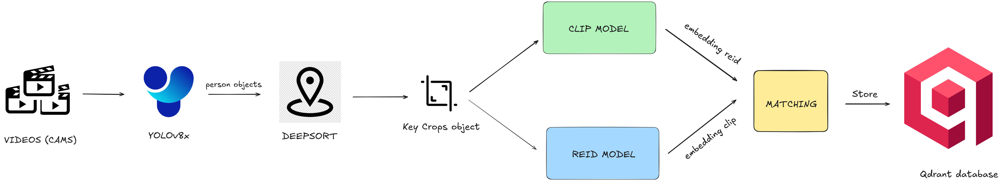
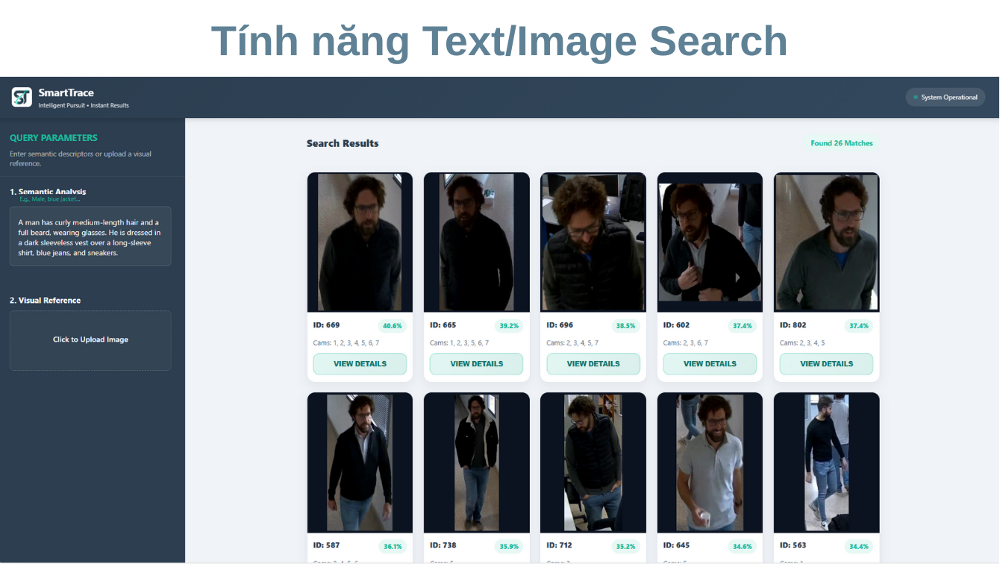
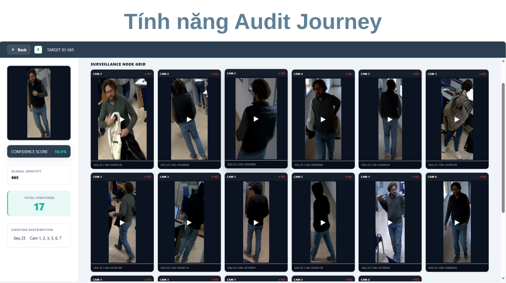

# SmartTrace: Multi-Camera Person Search & Tracking System

## Introduction
**SmartTrace** is a multi-camera **person search and re-identification (Person Re-ID)** system. It combines deep learning feature extraction with a vector database to identify and track individuals across multiple camera viewpoints and times.

The system focuses on:
- Detecting and tracking people per camera
- Extracting robust embeddings (OSNet + CLIP)
- Matching identities across cameras to form **global IDs**
- Enabling **multi-modal search** (image + text) powered by a vector database (**Qdrant**)

---

## Team Members & Responsibilities

| Member | Responsibilities |
|---|---|
| **Phạm Anh Kiệt** | **Embeddings:** run OSNet and CLIP embeddings<br>**Matching + Database:** associate objects across cameras and store into DB<br>**System:** multi-modal search system<br>**Backend:** API for SmartTrace web app |
| **Lê Thiên Bảo** | **Tracking:** detection + person tracking per camera<br>**Embeddings:** run OSNet and CLIP embeddings<br>**Evaluation:** evaluate with ReID and Tracking metrics |
| **Lê Ngọc Phương Nga** | **Frontend:** SmartTrace web UI<br>**Data for evaluation:** prepare evaluation data (videos + MOT `.txt` labels) |

---

## System Architecture

SmartTrace consists of **two main stages**:

### Stage 1 — Video Processing
</img>

This stage performs:
1. **Detection & Tracking** on each camera stream (per-camera trajectories / tracklets)
2. **Feature extraction** using **OSNet** and **CLIP**
3. **Multi-camera matching** to link the same person across cameras
4. Store **metadata + embeddings** into **Qdrant vector database**

### Stage 2 — Retrieval & Search
</img>

This stage provides:
- **Multi-modal search** (text + image)
- **Cross-camera tracing** (retrieve the person’s appearances across cameras)
- Result visualization with a **video timeline**

---

## Installation & Running

### 1) Clone the repository
```bash
git clone <repository-url>
cd PersonRetrieval
```

### 2) Install dependencies
```bash
pip install -r requirements.txt
```

---

## Stage 1: Video Processing Pipeline

### Step 1 — Tracking (Detection + MOT)
Open and run:
- `mot/run_mot.ipynb`

This produces per-camera tracking results.

### Step 2 — In-camera matching
```bash
python mmc/matching_cam.py
```
Associates tracklets that belong to the same person **within** each camera.

### Step 3 — Cross-sequence / cross-camera matching
```bash
python mmc/matching_seq.py
```
Links identities **between** cameras/sequences to produce a **global ID**.

### Step 4 — Upload to Qdrant
```bash
python database/upload_data.py
```
Uploads embeddings + metadata to the **Qdrant** vector database.

---

## Stage 2: Search

Run the search application:
```bash
python app.py
```

Access the web app at:
- http://localhost:5000

---

## User Interface

### Home / Search page
</img>

Supports:
- **Search by image:** upload a query image of the target person
- **Search by text:** describe attributes (shirt color, pants, etc.)
- Results shown with **thumbnails** and **similarity scores**

### Detail page
</img>

Provides:
- Timeline of the person’s appearances
- Video clips with **bounding box annotations**
- Detailed metadata: camera, time, location

---

## Project Structure
```text
PersonRetrieval/
├── app.py                 # Flask backend API
├── requirements.txt       # Dependencies
├── models/                # Pre-trained models (OSNet)
├── mot/                   # Multi-object tracking
│   └── run_mot.ipynb      # Notebook to run tracking
|   ...
├── mmc/                   # Multi-camera matching
│   ├── matching_cam.py    # In-camera matching
│   └── matching_seq.py    # Cross-camera/sequence matching
|   ...
├── database/              # Database management
│   └── upload_data.py     # Upload to Qdrant
├── system_search/         # Search engine
│   └── search.py          # Search logic
|   ... 
├── templates/             # HTML templates
├── static/                # CSS, JS, assets
└── data/                  # Processed data
    ├── crops/             # Person crops
    ├── feature_objects/   # Embeddings
    └── global_ids/        # Global ID mappings
```

---

## Technologies Used
- **Deep Learning:** OSNet (TorchReID), CLIP (Open Clip)  
- **Tracking:** DeepSort + TorchReID
- **Vector Database:** Qdrant  
- **Backend:** Flask, Python  
- **Frontend:** HTML, CSS, JavaScript  
- **Video Processing:** FFmpeg  

---

## Acknowledgements
We sincerely thank our instructors and supervisors for their guidance and support.  
We also thank the open-source community and dataset providers that enabled the research and development of **SmartTrace**.

---

## License
MIT

---

## Contact
Email: `phamanhkiet97123@gmail.com`

